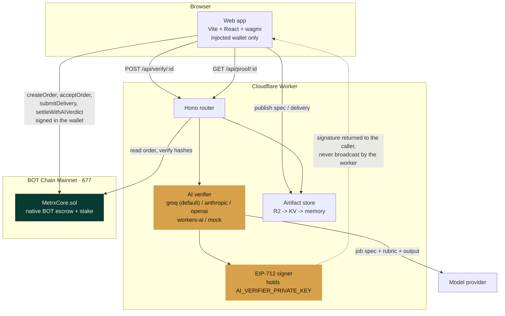
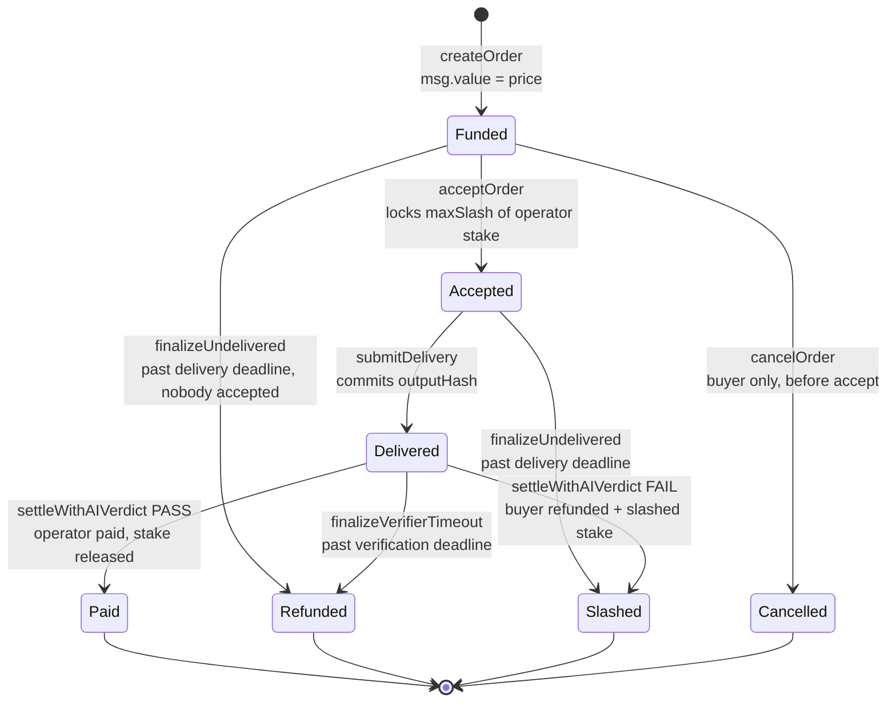
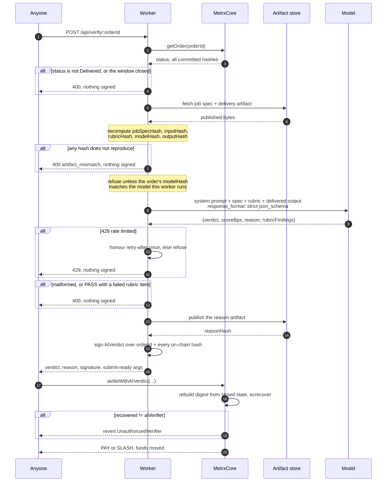

# Architecture

Metrx has four moving parts and one trusted party. This document shows where each sits and
exactly what crosses each boundary.

## System

Two properties fall out of this shape:

**The worker never holds funds and never broadcasts.** It signs a certificate and hands it
back. Whoever wants settlement pays their own gas to submit it. A worker outage cannot
strand an order, because the deadline paths resolve without it.

**The chain is the source of truth.** The worker reads order state from BOT Chain before it
will judge anything, and refuses if the published artifacts do not reproduce the hashes the
contract stores. There is no database whose disagreement with the chain could matter.

## Order state machine

Every terminal state assigns the full escrow to exactly one party:

| Terminal | Buyer receives | Operator receives | Stake slashed |
| --- | --- | --- | --- |
| `Paid` | — | `price` | 0, lock released |
| `Slashed` (FAIL verdict) | `price + maxSlash` | — | `maxSlash` |
| `Slashed` (undelivered) | `price + maxSlash` | — | `maxSlash` |
| `Refunded` (verifier timeout) | `price` | — | 0, lock released |
| `Refunded` (never accepted) | `price` | — | nothing was locked |
| `Cancelled` | `price` | — | nothing was locked |

The delivery and verification windows do not overlap, so `settleWithAIVerdict` and
`finalizeVerifierTimeout` are never both valid at the same instant.

## AI verifier sequence

The digest is rebuilt from contract storage, not from anything the caller supplies. A
certificate for a different order, a looser rubric, a cheaper model, or a different output
simply fails to recover the verifier address.

## Mainnet proof path

```mermaid
graph LR
  A["pnpm seam:check<br/>chain 677 live, deployer funded"] --> B["pnpm contracts:test<br/>52 Foundry tests"]
  B --> C["pnpm test<br/>reference model + full loop on anvil"]
  C --> D["pnpm contracts:deploy<br/>--legacy broadcast"]
  D --> E["pnpm abi:sync<br/>address into shared package"]
  E --> F["pnpm contracts:verify<br/>source on BOTScan"]
  F --> G["pnpm proof:run<br/>one PASS, one FAIL, on mainnet"]
  G --> H["pnpm claim:verify<br/>re-read every claim from chain"]
  H --> I["/proof and /proof/:id<br/>public, no wallet"]
```

## Hashing and artifacts

Everything committed on-chain is a keccak256 hash of a canonical serialisation:

| Field | Committed by | Preimage |
| --- | --- | --- |
| `jobSpecHash` | buyer, at creation | canonical JSON of the whole spec |
| `inputHash` | buyer, at creation | the raw input text |
| `rubricHash` | buyer, at creation | canonical JSON of the rubric array |
| `modelHash` | buyer, at creation | the verifier model id |
| `outputHash` | operator, at delivery | the raw output text |
| `deliveryArtifactHash` | operator, at delivery | canonical JSON of the delivery record |
| `verdictReasonHash` | verifier, at settlement | canonical JSON of the reason artifact |

Canonical JSON sorts object keys, preserves array order, and drops `undefined`. The browser
and the worker share one implementation (`packages/shared/src/hashing.ts`), so a spec hashed
at creation reproduces byte-for-byte at verification.

Artifacts are content-addressed by exactly the hash the contract stores. The store picks the
first available backend — R2, then KV, then an in-process map for local development — and
`/api/config` reports which one is live, so a memory-backed dev worker can never be mistaken
for durable storage.

## Why there is no database

Order state, operator stake, and settlement outcomes all live in the contract. Artifacts are the
only off-chain data, and they are content-addressed, so tampering is detectable by anyone holding
the transaction. Adding an indexer would introduce a second source of truth that could disagree
with the chain, which is exactly the failure Metrx exists to remove.

Reads are plain `eth_call`s. BOT Chain has no Multicall3 deployment, so anything built on viem's
`multicall` fails with `ChainDoesNotSupportContract` — and because that throws before the first
order is read, it surfaces as an empty list rather than as an error. The app batches in bounded
waves; the worker coalesces calls into JSON-RPC batches to stay under the Workers subrequest
ceiling.

Where an index is genuinely needed, it is derived from event logs rather than stored. `OrderCreated`
indexes the buyer, `OrderAccepted` indexes the operator, and `OperatorRegistered` indexes the
operator address, which is enough to answer "my orders" and "who can accept this" without a
database and without a contract change. The same trick recovers a settlement's transaction hash,
which a contract can never store about itself.

## API surface

Every route is public and unauthenticated. Nothing here can move funds: the worker signs, and
whoever wants settlement pays their own gas to submit.

| Route | Purpose |
| --- | --- |
| `GET /api/health` | liveness |
| `GET /api/config` | chain, contract, verifier model and address, artifact backend in use |
| `POST /api/artifacts` | publish a job spec, delivery or reason; returns the content hash and derived sub-hashes |
| `GET /api/artifacts/:hash` | fetch a published artifact so anyone can re-derive its hash |
| `GET /api/orders` | recent orders, or `?address=` for one participant's orders via the log index |
| `GET /api/orders/:id` | one order as stored on chain |
| `GET /api/operators` | the supply side: registered operators and the largest unlocked stake |
| `POST /api/verify/:orderId` | run the verifier and sign a certificate; cached per committed output, rate limited |
| `GET /api/verify/:orderId` | a previously signed certificate, so a reload never re-spends quota |
| `POST /api/preview` | dry-run a rubric against a sample output; no order, no chain write, no signature |
| `GET /api/proof` | index of settled orders |
| `GET /api/proof/:orderId` | full public evidence: artifacts, hash checks, transaction trail, certificate |
